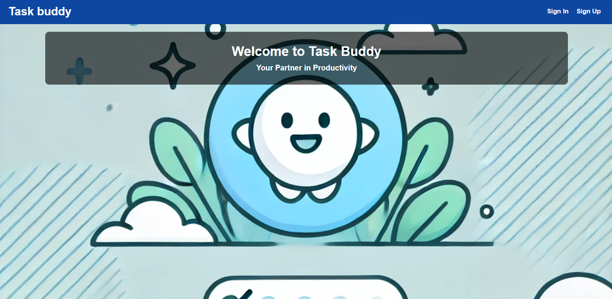

Software Engineering Bootcamp (July 2024) 
Project Assignment 2 - [General Assembly](https://generalassemb.ly/) 
[Task Buddy Github Repository](https://github.com/JPham4801/todo-app/)

# Task Buddy

Task Buddy is a simple and efficient Todo app designed to help you manage your tasks and stay organized.

## Getting Started

Task Buddy is a todo app that allows users to add, edit, delete, and easily manage their tasks. It helps you keep track of your daily activities and stay organized. This app was built as part of a coding boot camp's project to showcase our understanding of *MongoDB*, *Express*, and *Node.js* (*MEN* Stack). 

[Task Buddy](https://jpham4801-todo-app-9766fd1c2fc4.herokuapp.com/) - Powered by [Heroku](https://id.heroku.com/)

Project planning [Trello board](https://trello.com/invite/b/669a38c43fa77c9ff1e98baa/ATTI0f042b034a2a23214e6eea085f030a824FB22E13/project-management)

## Attributions 

- [Express](https://expressjs.com/)
- [MongoDB](https://www.mongodb.com/)
- [React](https://reactjs.org/)
- [bcrypt](https://www.npmjs.com/package/bcrypt)
- [ejs](https://ejs.co/)
- [mongoose](https://mongoosejs.com/)
- [morgan](https://www.npmjs.com/package/morgan)

## Technologies Used

**Front End**

**Back End**

**Database**

## Next Steps

Implement more advance techniques for managing higher levels of authentications and shared permissions with user Schemas and tasks